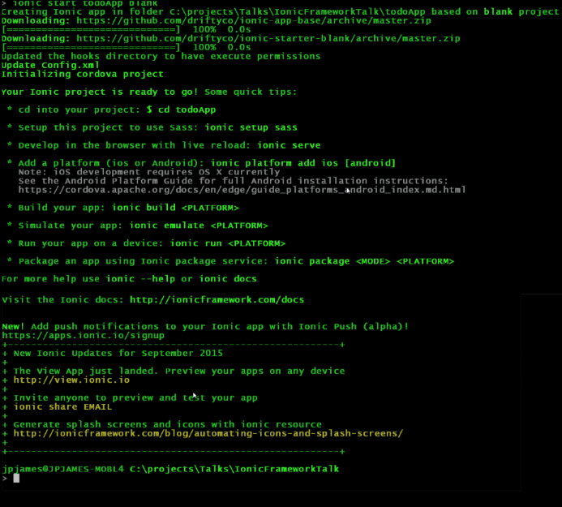
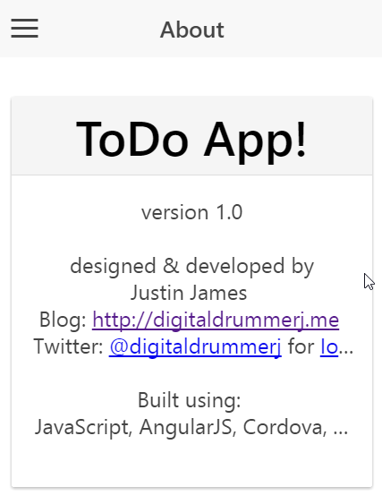
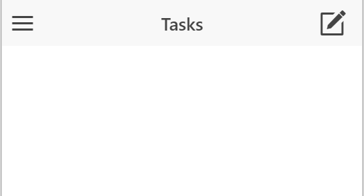

#Ionic Todo App Lab

In this lab we will be creating an application to store your Todo list.  

Objectives:

1. Get your machine setup for Ionic
2. Create a working application 

##Section 1: Setup

###Section 1.1: Install Git (Windows Only)

The default Ionic templates are downloaded from git when you start a new project.

1. Download git at [https://git-scm.com/download/win](https://git-scm.com/download/win)
1. Run the installer and keep all of the defaults
1. After the install completes, open a command prompt and run the following command

		git --version

###Section 1.2: Install NodeJS

In this section we will be installign NodeJs is you do not have it already installed.  To check to see if you have node install or not, open a command prompt or terminal and run the following command:    
		
		$ node -v 

1. If you do not have nodejs installed, download it from [http://nodejs.org](http://nodejs.org)
1. After the installer downloads, run it and keep all of the defaults
1. To verify the node install, open a new command prompt or terminal and the run the following command:

		$ node -v

###Section 1.3: Configure Npm

We are going to turn off the npm spinner and turn on http messages so that you will be able to see that npm is actually doing something 

1. Open a Command Prompt or Terminal
1. Run the following commands:

		$ npm config set spin false
		$ npm config set loglevel http

1. Verify that the settings are set

		$ npm config ls

###Section 1.4: Installing Ionic
	
1. Install the following npm packages

		$ npm install -g ionic gulp bower  
   
1. Verify the installs by running the following commands

###Section 1.5: Installing a Text Editor

You can use any text editor to developer your ionic project.  I personally am using Visual Studio Code right now but any text editor will do.

* Visual Studio Code (free) - [https://code.visualstudio.com](https://code.visualstudio.com)
* Brackets (free) - [http://brackets.io](http://brackets.io)
* Webstorm (paid)  - [https://www.jetbrains.com/webstorm](https://www.jetbrains.com/webstorm)
* Sublime Text (paid) - [http://www.sublimetext.com](http://www.sublimetext.com) 

##Section 2: Creating the Project

In this section we will be creating the initial ionic project.
 
1. Open a command prompt or terminal
1. Navigate where you normally keep your source code.  I keep mine at c:\projects

		
		$ mkdir c:\projects
		$ cd c:\projects 

1. Run the ionic start command to create your project

		$ ionic start todoApp https://github.com/Ionic-AZ/todoAppTemplate

1. You should see output like this screenshot if everything is working correctly.    
		
1. Running our todoApp

		$ cd todoApp && ionic serve 

1. You should see a web browser open and the page will look like the following
		

##Section 3: Add the Task View

In the templates folder, there is a file called task.html.  This file will be used to show the task for the selected project.  Right now, it is just a shell of a file.

The first thing we need to do is wire this up to the router so that the task.html file becomes the default view.

###Section 3.1: Adding the Route
1.  Open the www\js\app.js
1.  Add new route for the task page by copying the app.about route
	* state: "app.tasks"
	* url: "/tasks"
	* templateUrl: "templates/tasks.html
1. Add a controller to the app.tasks view.  
	* controller: 'ToDoController' 
1. Save the app.js file
	

###Section 3.2: Making the Task page the default

To make the app.task route we added the default route, we need to update the otherwise route.

**Note:** When specifying the route in the urls like otherwise uses, the periods in the route name become forward slashes (/).

###Section 3.3: Verify that the task page is now the default route

* If you still have the ionic serve running, then the browser should refresh automatically for you.  
* If you do not have ionic serve running:
 	1. Open a command prompt or terminal
	1. Navigate to your todoApp directory (e.g. c:\projects\todoApp)
	1. Run:
		
			ionic serve

* You may have noticed that the task view did not automatically appear.  This is because the url was set to #/app/about.  You need to remove #/app/about from the url.  
* Your page should now look like:

	

##Section 4: Creating New Project 

In this section will be adding a button to show the new project modal dialog, creating a new project, and updating the task view with the new project.

###Section 4.1: Opening the New Project Modal Dialog

I have already created the new-project.html that will be used as the template for the modal dialog.  We just need to wire it up so that we can open and close it.

1. Open the www\js\controllers\AppController.js
1. Inside the AppController function we need to define an ionicModal that gets the template from the url templates/new-project.html and tell it that the modal scope is $scope 

		$ionicModal.fromTemplateUrl('[Your Template Url', function(modal) {
			[Code From Next Step Here]
		}, {
			scope: [Your Scope]
		});

1. Inside the modal callback function you need to set a scope variable called projectModal to the modal.
1. The last thing that we need to do is inject the $ionicModal into the AppController like we did for the $scope and Projects.
1. Save the www\js\controllers\AppController.js fle

Now that we have defined the modal, we can created a button to open up the modal in the next section.

###Section 4.2: Show New Project Dialog

We are going to add an icon that when clicked will open up the new project modal.

1. Open the www\templates\menu.html
1. To the projects header bar we need to a button element with a class of button
1. Next we need to tell ionic that this button should be displayed as an icon.  To do this you need to add two more classes to the button

		button-icon 
		ion-plus 
1. Finally we need to tell Angular to call a function when the button is clicked.  The function will be named showProjectModal.  
	* **Hint:** use ng-click 

1. Save the menu.html file

Now we need to update the AppController to have the showProjectModal function that will open the dialog.
 
1. Open the www\js\controllers\AppController.js
1. Go ahead and create a function called showProjectModal on the $scope
1. The showProjectModal function will call

		$scope.projectModal.show(); 

1. Now if you go back to your browser, open the menu and click on the + icon, it will open the New Project dialog.  

Right now the dialog just opens.  The cancel and save buttons are non-functional.   If this was on a device there is no way to refresh the page, so the only to close the dialog would be to close the application down and re-open it. We will wire them up in the next couple of sections.

###Section 4.3: Wiring up the New Project Modal Cancel Link

The new-project view already has the cancel button set to call the closeNewProject function.  We just need to create the closeNewProject function in the AppController.

1. Open the www\js\controllers\AppController.js
1. Add a function to the $scope called closeNewProject
1. Inside the function called the 

			$scope.projectModal.hide();

1. Save the AppController.js file
1. Now in the browser, if you open up the new project modal and click the cancel button it will close.

###Section 4.4: Saving a New Project

Now that we have the new project modal opening and closing, we are ready to actually create a project.

The new project modal save button is already wired up to call the newProject function.  We just need to create the function in the AppController.

1. Open the www\js\controllers\AppController.js
1. Create a function on the scope called newProject that takes one parameter called project.
1. Add the following code to the newProject function to get the entered project title 
 
		var projectTitle = project.title;
		if(projectTitle) {
		}	

1. Call the Projects.newProject function, pass the project title into it and store the returned value from the function in a variable called newProject.
1. Add the newProject to the $scope.projects 
	* **Hint:** $scope.projects is an array so you need to push to the array
1. Call the Projects.save function and save the $scope.projects.
1. Now we need to hide the project modal and set the project title
1. You will also want to call $ionicSideMenuDelegate.toggleLeft() to close the menu.  Don't forget to inject $ionicSideMenuDelegate into the controller.
1. Save the AppController.js
1. Go back to the browser and you should now be able to add a new project.

You may have noticed that nothing visible changed to show that the project was saved.  That is because the UI isn't yet wired up to show the project list on the side menu.  We will do that in the next section.

###Section 4.5: Showing the Project List

We already have an ion-list in the side menu.  In this section you will add a new ion-item with an ng-repeat to loop through the project list and display it.

1. Open the www\templates\menu.html
1. Find the ion-item with the About link.  We are going to add a new ion-item above this with an ng-repeat that loops through the projects and displays the project title.
<ion-item ng-repeat="project in projects">
1. Save the menu.html file
1. Now if you go back to the browser, refresh it and open up the side menu you will see your project list.  As you create new projects they will show up in here.
 

Now that we can create projects we are ready to actual be able to add task to the project and display those task which we will do in the next section.

##Section 5: Task for a Project

In this section we will show the task for the selected project and be able to add new task to the project.

###Section 5.1: Selecting a Project

Before we can add a new task, we need to know which project to add them to which means that when we click on a project in the side menu, it will change the task view  to this project.

1. Open the www\js\controllers\AppController.js
1. Inside the AppController function create a new function on the scope called selectProject that takes in 2 parameters called project and index.
	* Set a variable on the scope called activeProject and set it to the project parameter.
	* Call the Projects setLastActiveIndex and pass it the index parameer.
	* Now we need to close the menu.  You can do this 2 ways:  Add the menu-close attribute to the ion-item in the menu.html file or call the $ionicSideMenuDelegate.toggleLeft();
1. Save the AppController.js file
1. Open the www\templates\menu.html
1. Find the ion-item that is showing all of the projects. 
1. We need to add an ng-click to  this to call the selectProject function and pass in the project and the $index.
1. Save the menu.html file
1. Now if you go back to the browser, you should be able to select a project and the title of the task view will change to the project name.

###Section 5.2: Setting Active Project on Project Creation

You will notice right now if you create a new project that it is not set to the active project like it should be.  

1. Open the www\js\controllers\AppController.js
1. Find the newProject function and add the following lines to it to set the activeProject to the newProject and call the Project service to set the active index number.

		$scope.activeProject = newProject;
		Projects.setLastActiveIndex($scope.projects.length);

###Section 5.3: Creating a New Task

I have already wired up the new task button to open the task modal and close it when you click either save or cancel.  You will need to write the logic to save the task to the project.   

1. Open the www\js\controllers\ToDoController.js
1. Inside the TodoController find the createTask function. 
1. Uncomment the if statement check.  This check makes sure that there is a project select and that the task is not blank.
1. The task list is an array of strings on the active project.  You need to push the new task.title to the active project tasks that is on the $scope.activeProject.
1. Next, you need to call  the Projects.save and pass in the $scope.projects.
1. Now you are ready to set the task title to a blank string so that next time you open the dialog it does not contain the title of the previous task.
1. Finally hide the modal dialog

At this point task are being saved but they will not be displayed to the screen until we wire up an ion-list to loop through the project tasks.  

###Section 5.4: Showing the Task List for the Project

In the task.html page we need to add an ion-list to loop through the task for the project and display the title property.

1. Open the www\templates\task.html
1. We will be adding the ion-list inside the ion-content
1. Add an ion-list 
1. Inside the ion-list add an ion-item that loops through the activeProject.tasks and displays the title property of the project.
1. Save the tasks.html file
1. Now if you go back to the browser, refresh it, select a project, add a new task, they will show up in the task list.
 

##Conclusion

Congratulation on completing your first Ionic application.  This is just a start though as there are several features that are missing from the application that you would want to add in if you were to release this application.  

Possible Additional Features:

* Delete a project
* Complete a task
* Delete a task
* Re-order task
* Re-order project list
* Expand task to have more than just a title with stuff like due date, notes, label, background color, etc.    

 
